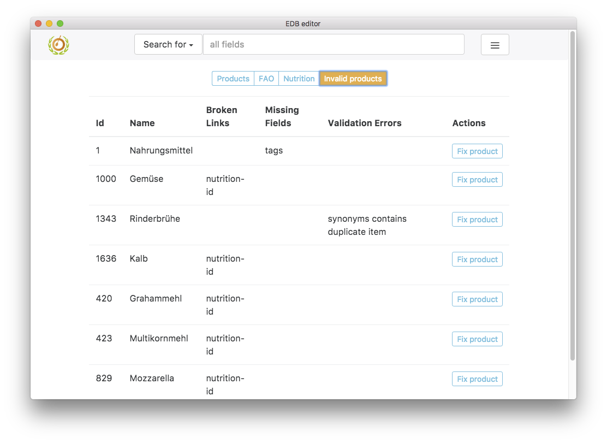

# eaternity-edb-solution

[](https://gitter.im/Eaternity/eaternity-edb-solution?utm_source=badge&utm_medium=badge&utm_campaign=pr-badge&utm_content=badge) [](https://travis-ci.org/Eaternity/eaternity-edb-solution)

---
# Information for users
This app was build to make editing of product.json files from the [eaternity-edb-data](https://github.com/Eaternity/eaternity-edb-data) repository easier and more efficient. A short user guide is given below.

## Download
You can download the newest version of the app for macOS, linux or windows in the [releases section](https://github.com/Eaternity/eaternity-edb-solution/releases) of this repo or from google drive.

## Installation
Should be straight forward, right?!

## Choose data folder
Download or clone the newest version of the [eaternity-edb-data](https://github.com/Eaternity/eaternity-edb-data) repository to you computer. Make sure you are on the master branch! This is your data folder.

Start the edb-solution app. You should see this start screen:


*sceenshot 1*

You can select the data folder by clicking on the "Choose data dir" button, from the menu on the right in the search bar or by dropping it on the app window. Remember, your data folder is the eaternity-edb-data repository you downloaded to your computer! If you choose another folder, nothing will happen!

Once you have selected the right data folder, product, fao and nutrition files are loaded and the app should look like this:


*screenshot 2*

__Important: All products are checked for errors (validated) and - if possible - fixed automatically once the data folder was selected. This means that all fields that are required via the linked parent product (linked-id) are pulled in automatically. At the moment there is no way to distinguish between fields that have been pulled from the parent product and fields that were entered manually... This will/should be fixed soon!__

## Using the search bar
You can switch between Products, FAO, Nutrition and Invalid products views by clicking the corresponding buttons in the button group under the search bar. In each of these views you can type into the search bar. The data table shown in the view will then be searched for what you have typed and updated dynamically. The search gets reseted once you switch the view.

## Sorting the table
The tables in the Products, FAO, Nutrition and Invalid products views can be sorted dynamically according to the values present in each column. To do so, simply click on the column headers.

## Edit a product
In the product view (screenshot 2) you can either double click a row or click on the 'Edit' button in the last column to edit a product. This will bring you to the Edit view, which shows all fields of the product:


*screenshot 3*

You can edit all fields except from the id. Input errors - for example typing a letter in the 'Density' field, which expects a number - will be recognized automatically and prevent you from saving the edited product. Certain fields (like "Linked to Product (Parent Product)") will provide you with autosuggest values once you start typing. This functionality will be added to more fields in the future.

When you are done editing and there are no errors, you can save the edited product with the save button on the very bottom of the view. Saving will overwrite the corresponding .json file in the eaternity-edb-data folder. You can verify this using `git diff` inside of that folder (explain better?).

## Add a new product
You can add a new product by clicking on the menu icon placed on the right in the header/search bar and choosing "Add new product":


*screenshot 4*

This will automatically generate a unique id and filename for the new product and bring you to the same edit view as described under 'Edit a product'.

## Check for invalid products
Products that failed validation and could not be fixed automatically when the app was started show up in the invalid product view:



You can click on the fix product button in the last column to fix the error manually. This will bring you to the exact same edit view as described under 'Edit a product'. The idea is that this view provides you with a quick and easy way to fix all invalid products.

---
# Information for developers

```bash
git clone https://github.com/mcmunder/eaternity-edb-solution.git
cd eaternity-edb-solution
npm install
```

Start in dev mode:
```bash
npm run dev
```

Start in production mode:
```bash
npm run build
npm start
```

## Packaging
To package the app, run one of the following commands:
```bash
npm run package # packaging for your platform
npm run package-win # packaging for windows
npm run package-linux # packaging for linux
npm run package-all # packaging for all platforms
```

Packaging for operating systems other than your local OS requires additional steps. See [here](https://github.com/electron-userland/electron-builder/wiki/Multi-Platform-Build) for more information.

---
# Copyright and license

Copyright 2017, eaternity.org  
Licensed under the [MIT license](./LICENSE).

This project is based on [electron-react-boilerplate](https://github.com/chentsulin/electron-react-boilerplate).

[](https://github.com/feross/standard)
